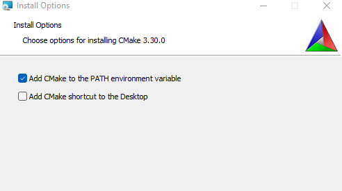
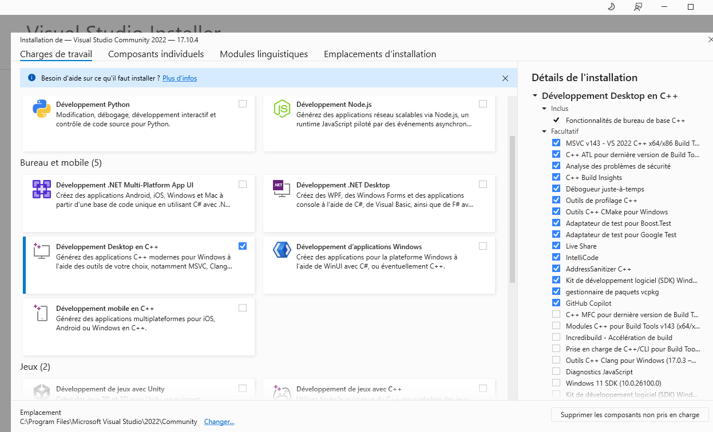
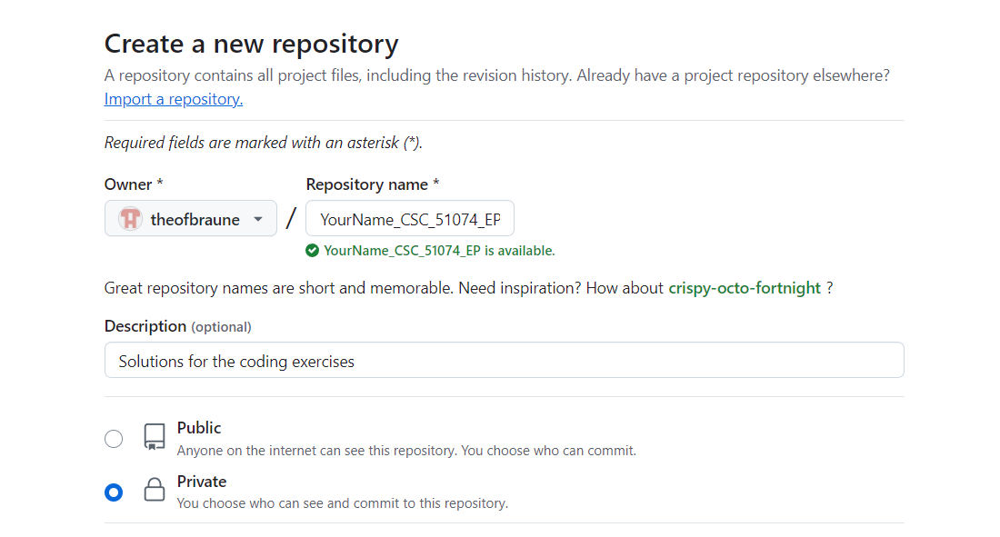
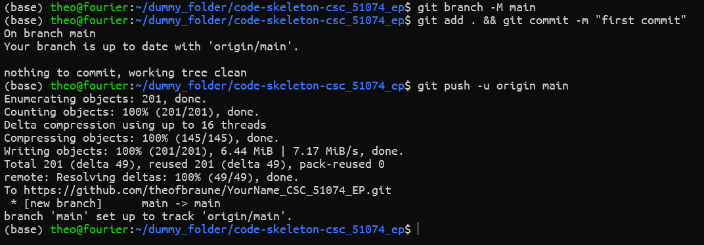

# Coding For CSC_51074_EP

Welcome to CSC_51074. This repository contains the code basis for every assignment. For every week, there is one assignment in the folders TDX. To get started clone this repository with all the necessary submodules through:

```shell
git clone https://gitlab.inria.fr/geomerix/public/teaching/code-skeleton-csc_51074_ep_2026.git
```

For this course we will use [Libigl](https://libigl.github.io/) as a 'geometric backbone', [Polyscope](https://polyscope.run/) for the visualization and animation of our geometries and [Googletest](https://google.github.io/googletest/) to properly test the software that you will write.

We will provide you every week with a new `.zip` folder with each weeks assignment. Please unzip each of them here in the root directory and remove the .zip file afterwards. You will then have the folder`cmake`, that is already there, alongside with folders called `TD1`, `TD2`... 

Depending on your operating system you may need to install a few things before you can get started if you have not coded in c++ before. Please let us if you encounter difficulties in the setup process.

### Linux

You will need to use the UNIX build essentials and CMake. If you don't have them already, they can be installed via

```shell
sudo apt install build-essential
sudo apt  install cmake
sudo apt-get install xorg-dev libglu1-mesa-dev freeglut3-dev mesa-common-dev
```

### Mac

You may need to install X11 dependencies.

```shell
brew install --cask xquartz
```

For Mac and Linux you can then go in the folder `TD1` and execute:

```shell
cd TD1
mkdir build && cd build
cmake ..
make -j8
./bin/td_1_executable
```

If you don't specify a mesh, the program will load a default mesh. You can run a specific mesh by running

```shell
./bin/td_1_executable /data/your_favorite_mesh.off
```

### Windows

You will need to install CMake and a c++ compiler, for instance the VisualStudio compiler.

Make sure that you add CMake to the Path.
||
|:----:|

When installing visual studio make sure that you pick the c++ tools.
||
|:----:|

Once this is done, you can open the Folder TDX in Visual Studio. If everything went well Visual Studio should recognise the CMakeLists.txt.

#### WSL

Alternatively, you can also install WSL2 (Windows Subsystem for Linux, https://learn.microsoft.com/fr-fr/windows/wsl/install). Once it is done, you can simply refer to the linux instructions above.

### Optional TD Submission

Once you clone this repo with all necessary submodules, please create your own github (or gitlab) repository. We recommend that you include your name and the course title in the reponame. Please do not use the binet gitlab for the creation of your repo, since if later you need to share your repo with us, we as teachers cannot access it.

You have to make the repo with your code private.
Thus, please create first a private repo
||
|:----:|
Then, once you are in the cloned repo on your machine, add the address of your newly created repository

```
~/code-skeleton-csc_51074_ep$ git remote set-url origin <your-repo-url>
```

Once you have done this, you can push the skeleton to your new repo via
||
|:----:|

We will be happy to help you with your TD assignments during the semester, you can contact us (Pooran Memari (memari@lix.polytechnique.fr) and Emilien Ganier (emilien.ganier@polytechnique.edu) ). If we can't help you and advise you to share your code with us, we will ask you to add us (Pooran Memari (memari@lix.polytechnique.fr) and Emilien Ganier (emilien.ganier@polytechnique.edu) ) as colaborators and give us write access. To do that, go in your repository to `settings`, click on `collaborators`, select `Add People` and add us with our mail adresses. This would allow you to share your code with us if needed. For this, please ensure that you are committing your code to your repository with the exact commit message that we will recommand for each specific case, for an easier tracking in your repo. Thanks. 


